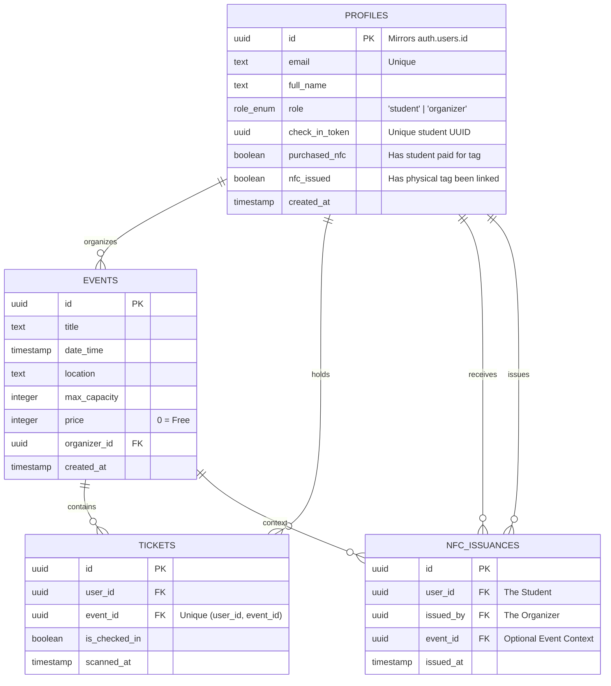
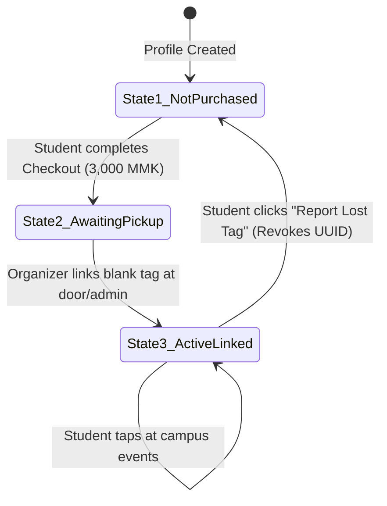
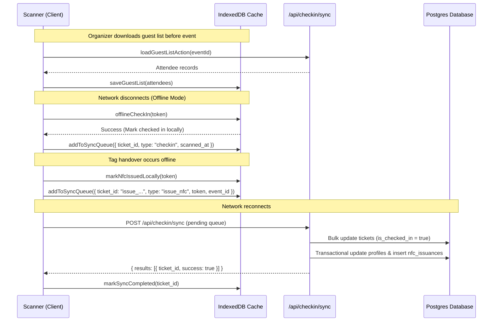

# CETDIS — Full Project Context & Architecture Guide

> **Campus Event Check-In System (CETDIS)**  
> A Next.js 16 Progressive Web Application built for high-throughput campus event ticketing, door check-in, offline synchronization, and physical Universal NFC pass management.

---

## 1. Project Overview & Philosophy

### Core Mission

CETDIS bridges digital campus identities with physical event entry. Students can RSVP to campus events, view their digital student pass, or tap in at the door using physical NFC wristbands/cards. Organizers can validate attendees using camera QR scanners or NFC hardware even in dead zones with zero internet connectivity.

### Key Architectural Pillars

1. **Offline-First Reliability**: Events often happen in campus basements or outdoor spaces with poor connectivity. The scanner downloads an event's guest list into browser IndexedDB, processes check-ins locally with instant sub-10ms response times, and flushes synced check-ins to the cloud when connectivity resumes.
2. **Universal Identity Model**: Check-in tokens belong to the student profile (`profiles.checkInToken`), not individual event tickets. One QR code or physical NFC wristband works across all events the student registers for.
3. **Decoupled Security & Token Revocation**: If a student loses their physical NFC tag, they can report it lost to immediately rotate their `checkInToken` UUID. This instantly destroys the lost tag's access while keeping their account and event registrations intact.
4. **Platform Supply Chain Ledger (Model 3)**: Platform collects NFC hardware revenue centrally. An immutable audit trail (`nfc_issuances`) tracks which organizer handed out blank tags to which student, providing exact inventory tracking and refill forecasting.

---

## 2. Technology Stack

| Layer                    | Technology                                  | Rationale                                                                                                                                |
| :----------------------- | :------------------------------------------ | :--------------------------------------------------------------------------------------------------------------------------------------- |
| **Framework**            | **Next.js 16 (App Router)**                 | Modern React Server Components, Server Actions in colocated `actions.ts`, and root `proxy.ts` (replacing deprecated `middleware.ts`).    |
| **Styling**              | **Tailwind CSS v4**                         | Clean, minimalist white aesthetic with zero heavy external UI component libraries.                                                       |
| **Authentication**       | **Supabase Auth**                           | Passwordless Email OTP (`supabase.auth.signInWithOtp`).                                                                                  |
| **Database & ORM**       | **PostgreSQL + Drizzle ORM**                | Type-safe schema definitions and SQL queries via `drizzle-orm`. Direct Supabase client is reserved strictly for auth session management. |
| **Offline Storage**      | **IndexedDB (`idb`)**                       | Client-side database caching event attendees, check-in statuses, NFC issuance states, and sync queues.                                   |
| **PWA & Service Worker** | **Serwist**                                 | Service worker caching static assets, shell HTML, and background synchronization events.                                                 |
| **Hardware / Scanning**  | **`html5-qrcode` & Web NFC (`NDEFReader`)** | Camera QR scanning with cleanup safeguards + native Web NFC reading/writing with simulation fallbacks for iOS/desktop.                   |
| **Testing**              | **Vitest**                                  | Fast unit and integration tests with mocked DB and session layers.                                                                       |

---

## 3. Database Architecture & Schema (`drizzle/schema.ts`)



### Table Definitions

1. **`profiles`**:
   - `id`: Primary key matching `auth.users.id`.
   - `checkInToken`: Randomly generated UUID string representing the student's universal identity token.
   - `purchasedNfc`: Tracks if the student completed checkout for a physical NFC pass.
   - `nfcIssued`: Tracks if an organizer has programmed and handed over a physical NFC tag.
2. **`events`**:
   - Holds event metadata, capacity limits, pricing in MMK, and organizer references.
3. **`tickets`**:
   - Bridge table between student profile and event.
   - Unique composite constraint on `(user_id, event_id)`.
   - Tracks `is_checked_in` and `scanned_at`.
4. **`nfc_issuances`**:
   - Strictly insert-only audit ledger recording every physical tag programming and handover.

---

## 4. Application Architecture & Routing Structure

```
cetdis/
├── app/
│   ├── (auth)/                     # Auth Route Group
│   │   ├── login/                  # Passwordless OTP login
│   │   └── verify/                 # OTP verification page
│   ├── (student)/                  # Student Route Group
│   │   ├── events/                 # Event discovery & RSVP
│   │   ├── tickets/                # My registered event tickets
│   │   └── my-id/                  # Universal Digital ID & NFC Tag Pass
│   │       ├── page.tsx            # Digital QR card + NFC section
│   │       ├── nfc-section.tsx     # 3-State lifecycle & Lost Tag flow
│   │       ├── nfc-checkout-modal.tsx # Payment checkout modal (KBZPay/WavePay)
│   │       └── actions.ts          # purchaseNfcAction & reportLostTagAction
│   ├── (organizer)/                # Organizer Route Group
│   │   ├── dashboard/              # Metrics, my events, & NFC inventory card
│   │   ├── events/new/             # Create event
│   │   ├── scan/                   # Door check-in scanner (QR + NFC)
│   │   │   ├── page.tsx
│   │   │   ├── scanner.tsx         # Unified camera/NFC scanning + offline queue
│   │   │   └── actions.ts          # checkInAction, loadGuestListAction, markNfcIssuedAction
│   │   └── admin/                  # Student lookup & NFC Tag Programming
│   │       ├── page.tsx
│   │       ├── nfc-issuer.tsx      # Admin NFC tag writer
│   │       └── actions.ts          # verifyProfileForNfc, markNfcIssuedAction
│   ├── api/
│   │   └── checkin/
│   │       └── sync/
│   │           └── route.ts        # Bulk offline sync handler (checkins + nfc issuances)
│   └── proxy.ts                    # Root Auth & Role-based Access Proxy (Next.js 16)
├── drizzle/
│   └── schema.ts                   # Drizzle ORM PostgreSQL schema
├── lib/
│   ├── idb.ts                      # IndexedDB wrapper (attendees cache & sync queue)
│   ├── offline-checkin.ts          # Optimistic local check-in & handover verification
│   └── sync.ts                     # Queue flusher & background reconciliation
└── utils/
    ├── db.ts                       # Drizzle DB connection instance
    └── supabase/                   # Supabase client helpers (client, server, middleware)
```

---

## 5. Core Workflows & User Lifecycles

### A. Student Pass & Decoupled NFC Lifecycle



1. **State 1 (Not Purchased)**:
   - Student uses standard digital QR code for event check-in.
   - Prompted to purchase an optional physical NFC Pass for 3,000 MMK (KBZPay / WavePay).
2. **State 2 (Awaiting Pickup)**:
   - `purchasedNfc: true`, `nfcIssued: false`.
   - Amber badge in `/my-id`. Student shows QR code to any organizer or door attendant.
3. **State 3 (Active & Linked)**:
   - `purchasedNfc: true`, `nfcIssued: true`.
   - Emerald badge. Student can tap into any event without unlocking their phone.
4. **Decoupled Lost Tag Reporting**:
   - If tag is lost, student taps **"Report Lost Tag"** in `/my-id`.
   - System immediately rotates `profiles.checkInToken` with a new UUID and resets `purchasedNfc: false, nfcIssued: false`.
   - The lost tag is instantly rendered useless. The student can purchase a replacement tag whenever ready.

---

### B. Organizer Door Check-In & Fast Walk-Up Handover

When an attendee arrives at an event:

1. **Scan / Tap**: Organizer points camera at attendee QR or taps attendee NFC tag.
2. **Lookup**:
   - **Online**: Calls `checkInAction(token, eventId)`.
   - **Offline**: Queries IndexedDB via `offlineCheckIn(token)`.
3. **Validation**:
   - If attendee not registered → returns `not_found`.
   - If attendee already checked in → returns `already_scanned`.
   - If attendee registered and valid → marks `is_checked_in = true`, records timestamp.
4. **Fast NFC Handover Modal**:
   - If the student has `purchasedNfc === true && nfcIssued === false`, the scanner triggers a modal:
     > _"Attendee purchased an NFC tag. Tap a blank tag now to link and hand over."_
   - Organizer taps a blank tag to write the student's `checkInToken` UUID.
   - Local DB updates immediately (`markNfcIssuedLocally`) to avoid duplicate prompts during offline scans.
   - Transactional ledger entry logged to `nfc_issuances`.

---

### C. Offline Synchronization Engine



---

## 6. Security, RLS & Access Control Rules

1. **Next.js 16 `proxy.ts`**:
   - Auth enforcement: Unauthenticated users are redirected to `/login`.
   - Role boundaries: Students accessing organizer routes are redirected to `/events`; organizers are routed to `/dashboard`.
2. **Database Row Level Security (RLS)**:
   - RLS is enabled on all tables in public schema.
   - Ownership predicates use `TO authenticated` with `USING (auth.uid() = user_id)` (never bypassing via `SECURITY DEFINER`).
3. **Idempotent Handover Transactions**:
   - `markNfcIssuedAction` runs inside `db.transaction()` and verifies `nfcIssued === false` before writing to prevent duplicate ledger entries.
4. **Token Isolation**:
   - Physical NFC tags contain **only** the raw UUID string (`checkInToken`). No sensitive personal details, names, or emails are stored on the physical tag.

---

## 7. Development & Verification Guide

### Prerequisites

- Node.js 20+
- pnpm package manager

### Environment Configuration (`.env.local`)

```env
NEXT_PUBLIC_SUPABASE_URL=https://<your-project>.supabase.co
NEXT_PUBLIC_SUPABASE_PUBLISHABLE_KEY=<your-anon-key>
NEXT_PUBLIC_APP_URL=http://localhost:3000
DATABASE_URL="postgresql://postgres.<tenant>:<password>@<pooler-host>:6543/postgres"
```

### Essential CLI Commands

```bash
# Start local development server
pnpm dev

# Run Vitest automated test suite
pnpm test

# Run TypeScript type safety verification
pnpm exec tsc --noEmit

# Generate Drizzle migration files
pnpm drizzle-kit generate

# Run database migrations
pnpm drizzle-kit migrate
```
