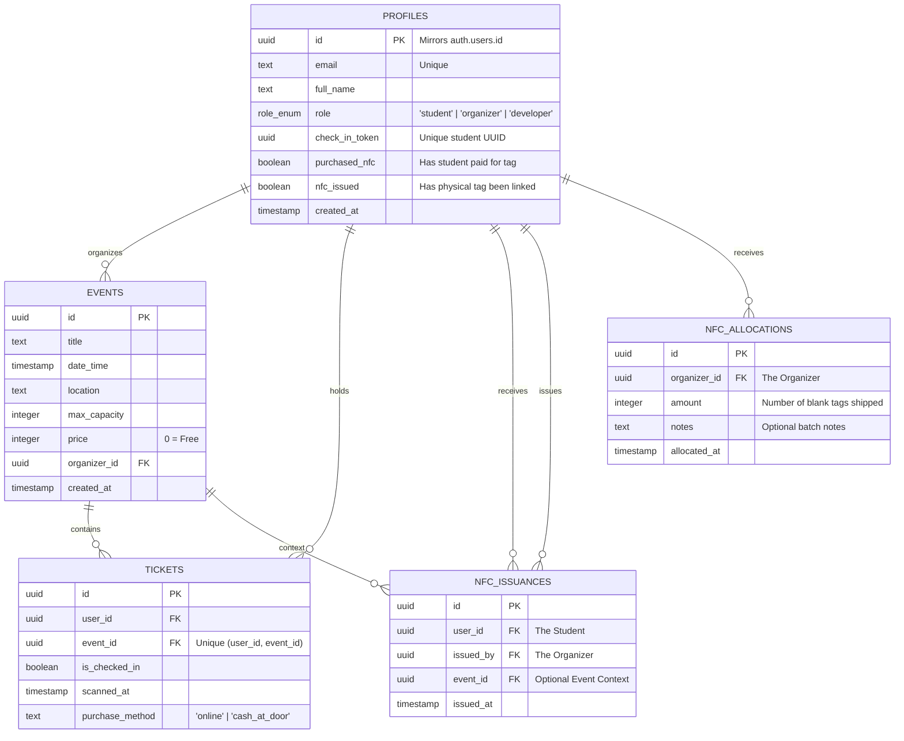
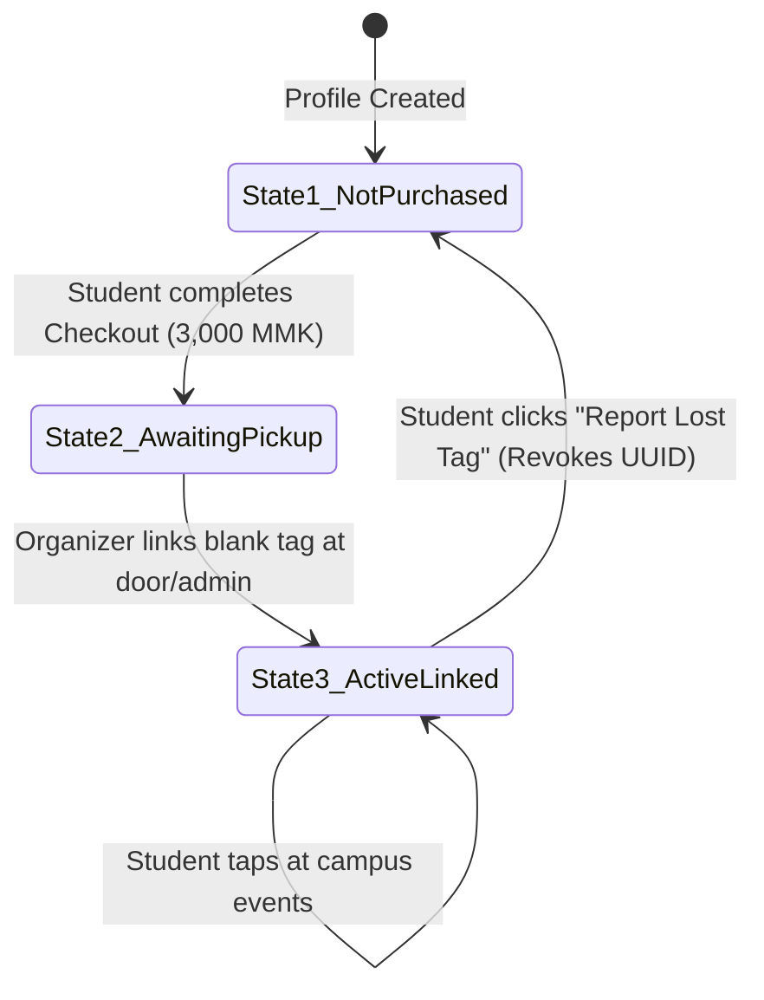
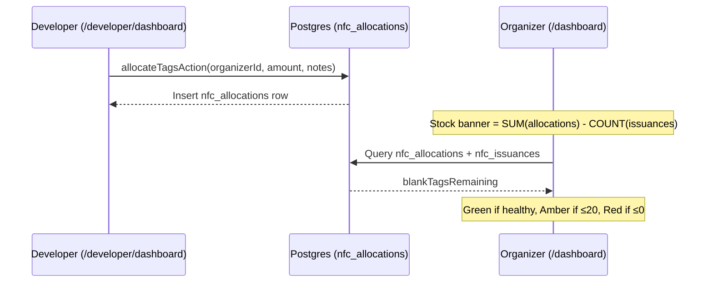
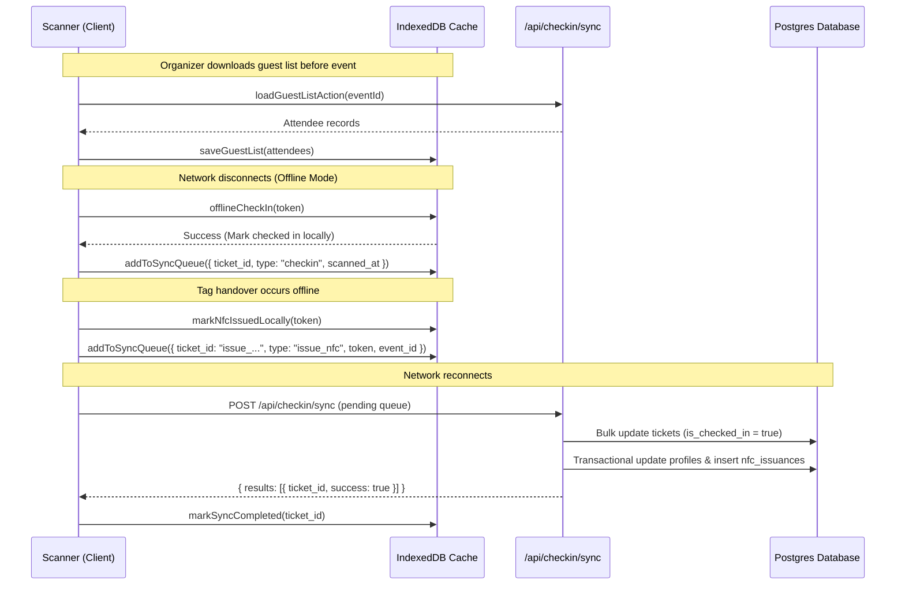

# CETDIS — Full Project Context & Architecture Guide

> **Campus Event Check-In System (CETDIS)**  
> A Next.js 16 Progressive Web Application built for high-throughput campus event ticketing, door check-in, offline synchronization, physical Universal NFC pass management, and at-the-door Walk-Up sales with cash reconciliation.

---

## 1. Project Overview & Philosophy

### Core Mission

CETDIS bridges digital campus identities with physical event entry. Students can RSVP to campus events, view their digital student pass, or tap in at the door using physical NFC wristbands/cards. Organizers can validate attendees using camera QR scanners or NFC hardware even in dead zones with zero internet connectivity, as well as sell tickets at the door in under 15 seconds.

### Key Architectural Pillars

1. **Offline-First Reliability**: Events often happen in campus basements or outdoor spaces with poor connectivity. The scanner downloads an event's guest list into browser IndexedDB, processes check-ins locally with instant sub-10ms response times, and flushes synced check-ins to the cloud when connectivity resumes.
2. **Universal Identity Model**: Check-in tokens belong to the student profile (`profiles.checkInToken`), not individual event tickets. One QR code or physical NFC wristband works across all events the student registers for.
3. **Decoupled Security & Token Revocation**: If a student loses their physical NFC tag, they can report it lost to immediately rotate their `checkInToken` UUID. This instantly destroys the lost tag's access while keeping their account and event registrations intact.
4. **Walk-Up Sales & Cash Reconciliation**: Handles both registered students who forgot to RSVP (Scenario A) and anonymous/guest walk-ups (Scenario B) with ghost profile generation and instant phone NFC tag programming. Automatically audits cash-at-door totals against ticket counts.
5. **Live Entrance vs. Schedule Separation**: The organizer dashboard is strictly focused on Today's live entrance operations with live capacity bars and check-in crowd rate progress. All upcoming and past events are managed in a dedicated `/events/all` view with real-time search, status tabs, and CSV guest list exports.
6. **Platform Supply Chain Ledger**: Platform collects NFC hardware revenue centrally. An immutable audit trail (`nfc_issuances`) tracks every physical tag handover. A separate mutable ledger (`nfc_allocations`) tracks blank tag rolls shipped by the platform developer to each organizer, enabling inventory forecasting and low-stock alerting.

---

## 2. Technology Stack

| Layer                    | Technology                                  | Rationale                                                                                                                                |
| :----------------------- | :------------------------------------------ | :--------------------------------------------------------------------------------------------------------------------------------------- |
| **Framework**            | **Next.js 16 (App Router)**                 | Modern React Server Components, Server Actions in colocated `actions.ts`, and root `proxy.ts` (replacing deprecated `middleware.ts`).    |
| **Styling & Font**       | **Tailwind CSS v4 + Inter Font**            | Clean, minimalist white aesthetic with zero heavy external UI component libraries. Inter typography via `next/font/google`.             |
| **Authentication**       | **Supabase Auth**                           | Passwordless Email OTP (`supabase.auth.signInWithOtp`).                                                                                  |
| **Database & ORM**       | **PostgreSQL + Drizzle ORM**                | Type-safe schema definitions and SQL queries via `drizzle-orm`. Direct Supabase client is reserved strictly for auth session management. |
| **Offline Storage**      | **IndexedDB (`idb`)**                       | Client-side database caching event attendees, check-in statuses, NFC issuance states, and sync queues.                                   |
| **PWA & Service Worker** | **Serwist**                                 | Service worker caching static assets, shell HTML, and background synchronization events.                                                 |
| **Hardware / Scanning**  | **`html5-qrcode` & Web NFC (`NDEFReader`)** | Camera QR scanning with cleanup safeguards + native Web NFC reading/writing with simulation fallbacks for iOS/desktop.                   |
| **Testing**              | **Vitest**                                  | Fast unit and integration tests with mocked DB and session layers (29 tests across 6 test suites).                                       |

---

## 3. Database Architecture & Schema (`drizzle/schema.ts`)



### Table Definitions

1. **`profiles`**:
   - `id`: Primary key matching `auth.users.id`.
   - `role`: `'student' | 'organizer' | 'developer'`. Developer is a platform admin role.
   - `checkInToken`: Randomly generated UUID string representing the student's universal identity token.
   - `purchasedNfc`: Tracks if the student completed checkout for a physical NFC pass.
   - `nfcIssued`: Tracks if an organizer has programmed and handed over a physical NFC tag.
2. **`events`**:
   - Holds event metadata, capacity limits, pricing in MMK, and organizer references.
3. **`tickets`**:
   - Bridge table between student profile and event.
   - Unique composite constraint on `(user_id, event_id)`.
   - Tracks `is_checked_in`, `scanned_at`, and `purchase_method` (`'online'` vs `'cash_at_door'`).
4. **`nfc_issuances`**:
   - Strictly insert-only audit ledger recording every physical tag programming and handover.
5. **`nfc_allocations`**:
   - Mutable ledger recording every batch of blank NFC tag rolls shipped from the platform developer to a specific organizer.
   - `amount`: The count of blank tags in the shipment.
   - `notes`: Optional free-text batch descriptor (e.g. "Mailed Starter Kit", "Handed at event").
   - Stock remaining for an organizer = `SUM(nfc_allocations.amount) - COUNT(nfc_issuances)`.

---

## 4. Application Architecture & Routing Structure

```
cetdis/
├── app/
│   ├── (auth)/                         # Auth Route Group
│   │   ├── login/                      # Passwordless OTP login
│   │   └── verify/                     # OTP verification page
│   ├── (student)/                      # Student Route Group
│   │   ├── events/                     # Student event discovery & RSVP
│   │   ├── tickets/                    # My registered event tickets
│   │   └── my-id/                      # Universal Digital ID & NFC Tag Pass
│   │       ├── page.tsx                # Digital QR card + NFC section
│   │       ├── nfc-section.tsx         # 3-State lifecycle & Lost Tag flow
│   │       ├── nfc-checkout-modal.tsx  # Payment checkout modal (KBZPay/WavePay)
│   │       └── actions.ts              # purchaseNfcAction & reportLostTagAction
│   ├── (organizer)/                    # Organizer Route Group
│   │   ├── layout.tsx                  # Organizer layout with DesktopSidebarNav & MobileBottomNav
│   │   ├── global-status-bar.tsx       # Live online/offline + pending sync badge & trigger
│   │   ├── nav-links.tsx               # Responsive sidebar and mobile bottom navigation tabs
│   │   ├── dashboard/                  # Dashboard Hub (Today's Live Operations)
│   │   │   ├── page.tsx                # Today's metrics, Action Center, and NFC inventory alert
│   │   │   ├── action-center.tsx       # Touch targets: Scanner, Walk-Up Sale modal, Live Search & NFC tap
│   │   │   ├── today-events.tsx        # Visual capacity bars, check-in crowd rate, and CSV export
│   │   │   └── actions.ts              # searchStudents, manualCheckIn, manualIssueNfc, issueGuestWalkUp, exportCSV
│   │   ├── events/                     # Event Management
│   │   │   ├── all/                    # Dedicated All Events view (/events/all)
│   │   │   │   ├── page.tsx            # Server page loading organizer's event list
│   │   │   │   └── events-list.tsx     # Filterable list: search, status tabs (All/Today/Upcoming/Past), price & sort
│   │   │   ├── new/                    # Create event (/events/new)
│   │   │   │   ├── page.tsx
│   │   │   │   └── actions.ts
│   │   │   └── [id]/edit/              # Edit event details (/events/[id]/edit)
│   │   │       ├── page.tsx
│   │   │       ├── edit-form.tsx
│   │   │       └── actions.ts
│   │   ├── scan/                       # Door check-in scanner (QR + NFC)
│   │   │   ├── page.tsx
│   │   │   ├── scanner.tsx             # Modernized camera/NFC scanning, Scenario A walkup + floating toolbar
│   │   │   └── actions.ts              # checkInAction, sellWalkUpTicketToStudentAction, loadGuestListAction
│   │   └── admin/                      # Student lookup & NFC Tag Programming
│   │       ├── page.tsx
│   │       ├── nfc-issuer.tsx          # Admin NFC tag writer
│   │       └── actions.ts              # verifyProfileForNfc, markNfcIssuedAction
│   ├── (developer)/                    # Developer (Platform Admin) Route Group
│   │   ├── layout.tsx                  # Clean white platform admin layout + role guard (developer only)
│   │   └── developer/
│   │       └── dashboard/              # → URL: /developer/dashboard
│   │           ├── page.tsx            # Platform stats + organizer inventory table
│   │           ├── actions.ts          # allocateTagsAction (role-gated)
│   │           └── allocation-modal.tsx # Client modal to ship a tag roll to an organizer
│   ├── api/
│   │   └── checkin/
│   │       └── sync/
│   │           └── route.ts            # Bulk offline sync handler (checkins + nfc issuances)
│   └── proxy.ts                        # Root Auth & Role-based Access Proxy (Next.js 16)
├── drizzle/
│   └── schema.ts                       # Drizzle ORM PostgreSQL schema
├── lib/
│   ├── idb.ts                          # IndexedDB wrapper (attendees cache & sync queue)
│   ├── offline-checkin.ts              # Optimistic local check-in & handover verification
│   ├── sync.ts                         # Queue flusher & background reconciliation
│   └── web-nfc.d.ts                    # Global Web NFC TypeScript definitions
├── scripts/
│   └── reset-nfc.mjs                   # Developer CLI tool to undo/reset NFC data
└── utils/
    ├── db.ts                           # Drizzle DB connection instance
    └── supabase/                       # Supabase client helpers (client, server, middleware)
```

---

## 5. Roles & Access Control

| Role        | Home Route             | Access                                                              |
| :---------- | :--------------------- | :------------------------------------------------------------------ |
| `student`   | `/my-id`               | `/events`, `/tickets`, `/my-id`                                     |
| `organizer` | `/dashboard`           | `/dashboard`, `/events/all`, `/events/new`, `/events/[id]/edit`, `/scan`, `/admin` |
| `developer` | `/developer/dashboard` | `/developer/*` only                                                 |

- `proxy.ts` enforces role boundaries; any wrong-role access redirects to that role's home.
- `(developer)/layout.tsx` performs a server-side role check and redirects non-developers to `/login`.
- `allocateTagsAction` additionally verifies `role === 'developer'` before writing to `nfc_allocations`.

---

## 6. Core Workflows & User Lifecycles

### A. Student Pass & Decoupled NFC Lifecycle



1. **State 1 (Not Purchased)**:
   - Student uses standard digital QR code for event check-in.
   - Prompted to purchase an optional physical NFC Pass for 3,000 MMK (KBZPay / WavePay).
2. **State 2 (Awaiting Pickup)**:
   - `purchasedNfc: true`, `nfcIssued: false`.
   - Amber badge in `/my-id`. Student shows QR code to any organizer or door attendant.
3. **State 3 (Active & Linked)**:
   - `purchasedNfc: true`, `nfcIssued: true`.
   - Emerald badge. Student can tap into any event without unlocking their phone.
4. **Decoupled Lost Tag Reporting**:
   - If tag is lost, student taps **"Report Lost Tag"** in `/my-id`.
   - System immediately rotates `profiles.checkInToken` with a new UUID and resets `purchasedNfc: false, nfcIssued: false`.
   - The lost tag is instantly rendered useless. The student can purchase a replacement tag whenever ready.

---

### B. Organizer Door Check-In & Modernized Scanner UX

When an attendee arrives at an event:

1. **Scan / Tap**: Organizer points camera at attendee QR or taps attendee NFC tag.
2. **Lookup**:
   - **Online**: Calls `checkInAction(token, eventId)`.
   - **Offline**: Queries IndexedDB via `offlineCheckIn(token)`.
3. **Validation**:
   - If attendee not registered → returns `no_ticket` (triggers Scenario A Walk-Up prompt) or `not_found`.
   - If attendee already checked in → returns `already_scanned`.
   - If attendee registered and valid → marks `is_checked_in = true`, records timestamp.
4. **Fast NFC Handover Modal**:
   - If the student has `purchasedNfc === true && nfcIssued === false`, the scanner triggers a modal:
     > _"Attendee purchased an NFC tag. Tap a blank tag now to link and hand over."_
   - Organizer taps a blank tag to write the student's `checkInToken` UUID.
   - Local DB updates immediately (`markNfcIssuedLocally`) to avoid duplicate prompts during offline scans.
   - Transactional ledger entry logged to `nfc_issuances`.
5. **Floating Bottom Toolbar**:
   - Real-time status chips: `Offline Cached` (with guest list refresh & switch to live buttons) vs `Live Mode`.
   - Animated unsynced queue counter pill with 1-tap manual sync flush (`↑ X Unsynced`).

---

### C. Walk-Up Sales & Cash Reconciliation (At-The-Door)

Designed to eliminate door bottlenecks and keep entry times under 15 seconds:

#### Scenario A: Existing Student (Forgot to RSVP)
1. Student scans QR or taps wristband at the door.
2. Scanner identifies the student profile but detects no ticket for the event.
3. Scanner immediately displays an amber prompt: **"User Recognized: [Full Name]. No Ticket for this Event."**
4. Organizer collects cash and taps **"Sell Ticket At Door & Admit"**.
5. Server action inserts `tickets` row with `purchaseMethod = 'cash_at_door'`, sets `isCheckedIn = true`, and flashes the green success screen.

#### Scenario B: The Guest (No App, No Account)
1. Organizer taps **"Walk-Up Sale"** in the Dashboard Action Center.
2. Selects event and enters optional name (or leaves blank for Anonymous).
3. Organizer collects cash and taps **"Collect Cash & Program NFC Tag"**.
4. Server action executes in an atomic transaction:
   - Inserts **Ghost Profile** (`guest-<token>@walkup.local`, `checkInToken`).
   - Inserts **Ticket** (`purchaseMethod = 'cash_at_door'`, `isCheckedIn = true`).
   - Inserts **NFC Issuance** record.
5. Modal prompts: _"Hold blank NFC tag to phone..."_ and writes the UUID to the physical tag via Web NFC.
6. Guest receives the physical tag and walks in. All future attendance can be tracked under this same tag.

#### Cash Box Reconciliation
- The dashboard automatically tracks `walkUpCount` and calculates `walkUpCount * event.price`.
- Displays a dedicated cash reconciliation pill on each event card (e.g. `12 walk-ups (60,000 MMK cash box)`), providing a clear audit trail against the physical cash box.

---

### D. Today's Live Dashboard vs All Events Management

1. **Dashboard (`/dashboard`)**:
   - Contains only high-velocity entrance tools: Massive **Open Scanner** touch target, **Walk-Up Sales**, **Manual Attendee Lookup** with phone NFC tap programming, and **Today's Events & Live Metrics**.
   - Displays real-time dual progress bars for each active event:
     - **Capacity Limit Bar**: `[Total Registered] / [Max Capacity]`
     - **Check-In Crowd Bar**: `[Checked In] / [Total Registered]` with live waiting counts.
2. **All Events Page (`/events/all`)**:
   - Filterable schedule view featuring instant search by title/location.
   - Status tabs with live counts (`All`, `Today`, `Upcoming`, `Past`).
   - Pricing filters (`Free Only`, `Paid Only`) and custom sort options.
   - 1-Tap **Export CSV** generating comprehensive attendee spreadsheets.

---

### E. Developer NFC Inventory Management



- Platform developer logs into `/developer/dashboard` to view all organizers' stock levels.
- Clicking **+ Allocate Tags** on any organizer row opens a modal to record a new shipment.
- `allocateTagsAction` is double-gated: Supabase session check + DB role verification.
- The organizer's `/dashboard` shows a dynamic stock banner only once they have received at least one allocation.

---

### F. Offline Synchronization Engine



---

## 7. Security, RLS & Access Control Rules

1. **Next.js 16 `proxy.ts`**:
   - Auth enforcement: Unauthenticated users are redirected to `/login`.
   - Role boundaries: Students accessing organizer routes are redirected to `/events`; organizers are routed to `/dashboard`; developers to `/developer/dashboard`.
2. **Database Row Level Security (RLS)**:
   - RLS is enabled on all tables in public schema.
   - Ownership predicates use `TO authenticated` with `USING (auth.uid() = user_id)` (never bypassing via `SECURITY DEFINER`).
3. **Idempotent Handover Transactions**:
   - `markNfcIssuedAction` and `manualIssueNfcAction` run inside `db.transaction()` and verify `nfcIssued === false` before writing to prevent duplicate ledger entries.
4. **Token Isolation**:
   - Physical NFC tags contain **only** the raw UUID string (`checkInToken`). No sensitive personal details, names, or emails are stored on the physical tag.
5. **Developer Action Guard**:
   - `allocateTagsAction` performs both a Supabase session check and a DB-level role assertion before inserting into `nfc_allocations`. Never trusted from the client alone.

---

## 8. Development & Verification Guide

### Prerequisites

- Node.js 20+
- pnpm package manager

### Environment Configuration (`.env.local`)

```env
NEXT_PUBLIC_SUPABASE_URL=https://<your-project>.supabase.co
NEXT_PUBLIC_SUPABASE_PUBLISHABLE_KEY=<your-anon-key>
NEXT_PUBLIC_APP_URL=http://localhost:3000
DATABASE_URL="postgresql://postgres.<tenant>:<password>@<pooler-host>:6543/postgres"
```

### Essential CLI Commands

```bash
# Start local development server
pnpm dev

# Run Vitest automated test suite (29 tests across 6 suites)
pnpm test

# Run TypeScript type safety verification
pnpm exec tsc --noEmit

# Reset NFC issuances for a student or all users (Devtool)
pnpm db:reset-nfc --email student@campus.edu
pnpm db:reset-nfc --all

# Generate Drizzle migration files
pnpm drizzle-kit generate

# Run database migrations
pnpm drizzle-kit migrate
```
